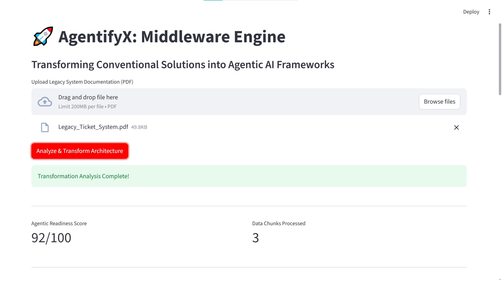
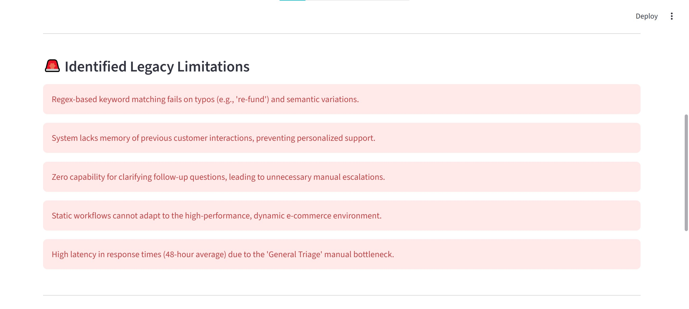
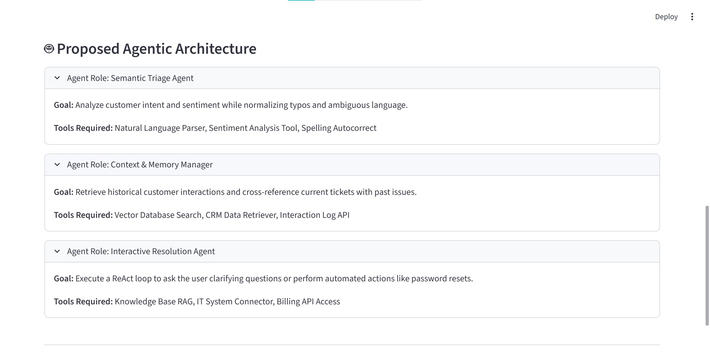
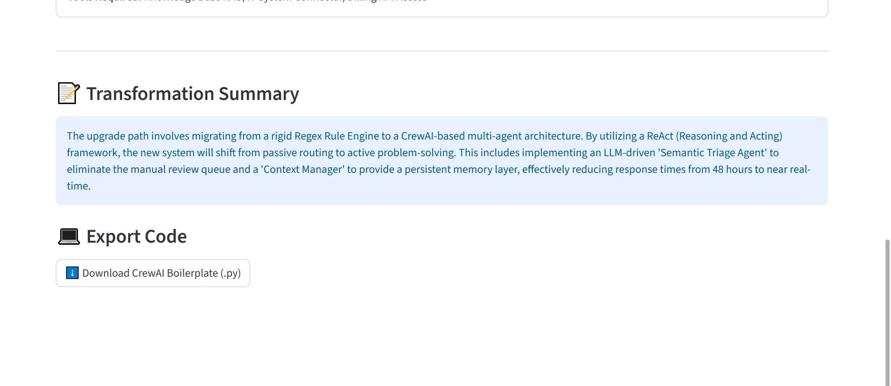
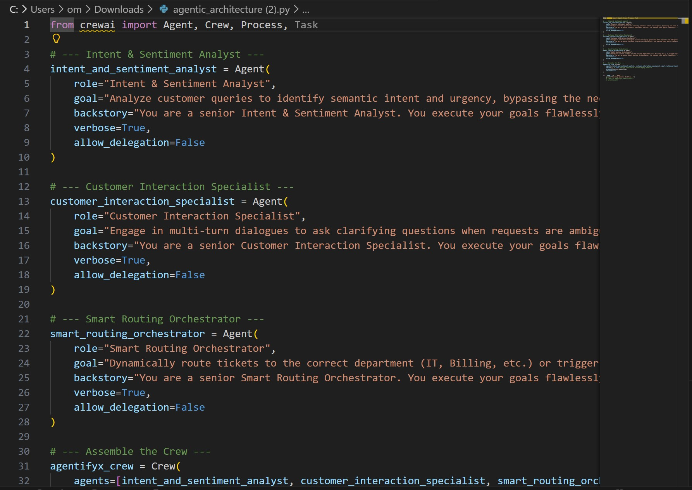

# 🚀 AgentifyX: Engineering the Change

> **A Middleware Engine for Transforming Conventional Solutions into Agentic AI Frameworks.**

AgentifyX is a reasoning-driven middleware designed to bridge legacy, rule-based digital solutions with modern autonomous architectures. Built for the **9th Edition TECHgium Challenge**, this system analyzes existing system documentation, evaluates its feasibility for agentic integration, and dynamically generates multi-agent blueprint code.

---

## 📸 Project Showcase


*Figure 1: The AgentifyX Streamlit Dashboard processing a legacy system document*


*Figure 2: AI-driven extraction of legacy system limitations*


*Figure 3: The dynamically generated Agentic Architecture blueprint*


*Figure 4: Strategic summary and the 1-click CrewAI code export feature*


*Figure 5: The exported CrewAI boilerplate code ready for developer implementation*

---

## 💡 The Problem

Most existing enterprise solutions are rigid, static, and lack autonomy. They rely on hard-coded rules (like Regex) and manual human escalation, making them inefficient in dynamic environments.

While organizations want to adopt Agentic AI frameworks (ReAct, CrewAI), there is no structured way to evaluate their existing systems or map out a safe transformation path.

---

## ⚙️ The Solution

AgentifyX acts as an intelligent layer that automates the modernization process.

1. **Ingest & Parse:** Extracts unstructured data, workflows, and goals from legacy documentation using PyMuPDF and spaCy.
2. **Semantic Memory:** Chunks and embeds the system logic into a local ChromaDB vector store.
3. **Reasoning Engine:** Uses Gemini via RAG to evaluate "Agentic Readiness" and map outdated logic to autonomous roles.
4. **Code Generation:** Automatically writes and exports a downloadable `.py` boilerplate script utilizing the CrewAI framework.

---

## 🛠️ Tech Stack

### Backend Core

| Technology | Purpose |
|---|---|
| **Python 3.10+** | Core runtime |
| **FastAPI** | High-performance asynchronous API framework |
| **Uvicorn** | ASGI server |

### AI & NLP Pipeline

| Technology | Purpose |
|---|---|
| **spaCy** | Intelligent sentence boundary detection and NLP chunking |
| **ChromaDB** | Local vector database for semantic memory retrieval |
| **Sentence-Transformers** | Semantic embedding generation |
| **Google Gemini-3-flash-preview** | Core LLM reasoning engine |

### Frontend & Orchestration

| Technology | Purpose |
|---|---|
| **Streamlit** | Interactive, real-time data dashboard |
| **CrewAI** | Multi-agent orchestration framework (target output) |

---

## 🚀 Running the Project Locally

### 1. Clone the Repository

```bash
git clone https://github.com/Krixna-Kant/AgentifyX.git
cd AgentifyX
```

### 2. Set Up the Virtual Environment

```bash
python -m venv venv

# Windows
venv\Scripts\activate

# Mac/Linux
source venv/bin/activate
```

### 3. Install Dependencies

```bash
pip install fastapi uvicorn pypdf pymupdf spacy chromadb sentence-transformers google-generativeai python-dotenv streamlit requests
python -m spacy download en_core_web_sm
```

### 4. Environment Variables

Create a `.env` file in the root directory and add your Gemini API key:

```env
GEMINI_API_KEY=your_actual_api_key_here
```

### 5. Launch the Services

You need **two terminals** running simultaneously.

**Terminal 1 — FastAPI Backend:**

```bash
uvicorn app.main:app --reload
```

**Terminal 2 — Streamlit Frontend:**

```bash
streamlit run app/frontend.py
```

Open the provided `localhost` URL in your browser to interact with the AgentifyX dashboard!

---

## 🏆 Hackathon Context

This project was developed for the **TECHgium 9th Edition Presentation Round** under **PID TG0914909**.

> **Challenge Statement Focus:** Build a reasoning-driven middleware engine that analyzes existing solution documentation and recommends functional and technical improvements using agentic frameworks.